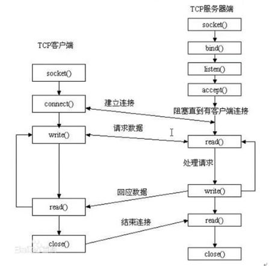

# 常用协议

HTTP、FTP、TCP/IP、ARP、

# 辅助函数

## atoi

```c
//ascii to integer
int atoi(const char *nptr);
//template
int n = atoi("123");
```


# socket

一个文件描述符指向一个套接字（该套接字内部由内核借助两个缓冲区实现）


## 预备知识

### 网络字节序

+ 小端字节序（主机）：高位字节存储在高地址处，低位字节存储在低地址处
+ 大端字节序（网络）：一个整数的高位字节（23-31 bit）存储在内存的低地址处，低位字节（0-7 bit）存储在内存的高地址处

```c
/* 
	h：host 主机
	n：network 网络
	l：32位长整数 4字节
	s：16位短整数 2字节
*/
//本地-->网络（IP）
uint32_t htonl(uint32_t hostlong);
//本地-->网络（port）
uint16_t htons(uint16_t hostshort);
//网络-->本地（IP）
uint32_t ntohl(uint32_t netlong);
//网络-->本地（port）
uint16_t ntohs(uint16_t netshort);
```

### IP地址转换函数

```c
//IP地址转换函数是为了简化以下步骤
//192.168.1.11 --> string --> atoi --> int --> htonl -->网络字节序
```

```c
/*
description：主机（string IP）-->网络
args:
	af：AF_INET、AF_INET6
	src：IP地址（点分十进制）
	dst：转换后的网络字节序的IP地址
return:
	success：1
	error：-1
*/
int inet_pton(int af,const char *src,void *dst);
/*
args：
	af：AF_INET、AF_INET6
	src：IP地址（网络字节序）
	dst：本地字节序（点分十进制）
	size：dst的大小
return：
	success：dst
	fail：NULL
*/
const char* inet_ntop(int af,const void* src,char *dst,socklen_t size);
```

### sockaddr

> man 7 ip

```c
struct sockaddr_in addr;
addr.sin_family = AF_INET;
addr.sin_port = htons(9527);
addr.sin_addr.s_addr = htonl(INADDR_ANY);
```

## 连接模型



## socket

```c
/*
args:
	domain：AF_INET、AF_INET6、AF_UNIX
	type：SOCK_STREAM、SOCK_DGRAM
	protocol：0
*/
int socket(int domain,int type,int protocol);
```

## bind

```c
/*
args:
	sockfd：socket函数返回值
	addr：(strruct sockaddr*)&addr
	addrlen：sizeof(addr) 地址结构的大小
*/
int bind(int sockfd,const struct sockaddr *addr,socklen_t addrlen);
```

## listen

设置同时与服务器建立连接的上限数（同时进行3次握手的客户端数量）

```c
/*
args:
	sockfd：socket函数返回值
	backlog：连接上限。最大值128
*/
int listen(int sockfd,int backlog);
```

## accept

阻塞等待客户端建立连接，成功的话，返回一个与客户端成功连接的socket文件描述符。

```c
/*
args:
	sockfd：socket函数返回值
	addr：连接上限。最大值128
	addrlen：
*/
int accept(int sockfd, struct sockaddr *addr, socklen_t *addrlen);
```


## connect


