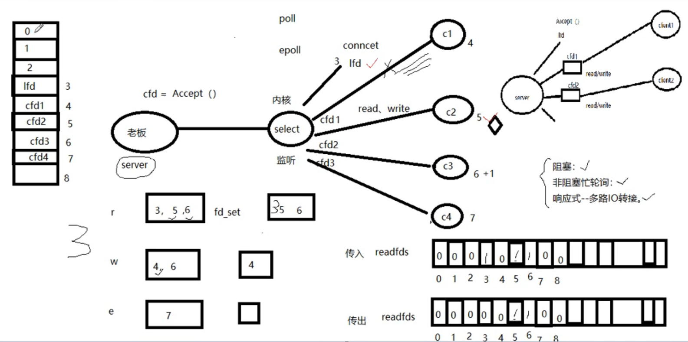

# 参考资料

+ TCP/IP 网络编程

# 常用协议

HTTP、FTP、TCP/IP、ARP、

## TCP

### TCP通信时序


### TCP状态转换


+ 2MSL

  > 注：2MSL超时期间，可通过设置**端口复用**，以使server在未完全断开前重新监听

  ```c
  int opt = 1;
  setsockopt(lfd,SOL_SOCKET,SO_REUSEADDR,(void *)&opt,sizeof());
  ```

+ 半关闭


### others

+ 三次握手

  

+ 四次挥手

  

+ 滑动窗口


## IP


# 常用工具

## netcat

```sh
nc 127.1 9999
```

## netstat

```sh
netstat -apn | grep port/client
```


# 辅助函数

## atoi

```c
//ascii to integer
int atoi(const char *nptr);
//template
int n = atoi("123");
```


# socket

一个文件描述符指向一个套接字（该套接字内部由内核借助两个缓冲区实现）


## 预备知识

### 网络字节序

+ 小端字节序（主机）：高位字节存储在高地址处，低位字节存储在低地址处
+ 大端字节序（网络）：一个整数的高位字节（23-31 bit）存储在内存的低地址处，低位字节（0-7 bit）存储在内存的高地址处

```c
/* 
	h：host 主机
	n：network 网络
	l：32位长整数 4字节
	s：16位短整数 2字节
*/
//本地-->网络（IP）
uint32_t htonl(uint32_t hostlong);
//本地-->网络（port）
uint16_t htons(uint16_t hostshort);
//网络-->本地（IP）
uint32_t ntohl(uint32_t netlong);
//网络-->本地（port）
uint16_t ntohs(uint16_t netshort);
```

### IP地址转换函数

```c
//IP地址转换函数是为了简化以下步骤
//192.168.1.11 -----atoi------>    int    -----htonl----->网络字节序
//	string          		   主机字节序
```

```c
/*
description：主机（string IP）-->网络
args:
	af：AF_INET、AF_INET6
	src：IP地址（点分十进制）
	dst：转换后的网络字节序的IP地址
return:
	success：1
	error：-1
*/
int inet_pton(int af,const char *src,void *dst);
/*
args：
	af：AF_INET、AF_INET6
	src：IP地址（网络字节序）
	dst：本地字节序（点分十进制）
	size：dst的大小
return：
	success：dst
	fail：NULL
*/
const char* inet_ntop(int af,const void* src,char *dst,socklen_t size);
```

### sockaddr

> man 7 ip

```c
struct sockaddr_in addr;
addr.sin_family = AF_INET;
addr.sin_port = htons(9527);
addr.sin_addr.s_addr = htonl(INADDR_ANY);
```

## 连接模型


| server：    |                        |
| ----------- | ---------------------- |
| 1. socket() | 创建socket             |
| 2. bind()   | 绑定服务器地址结构     |
| 3. listen() | 设置监听上限           |
| 4. accept() | 阻塞监听客户端连接     |
| 5. read()   | 读socket获取客户端数据 |
| 6. func()   | 业务函数               |
| 7. write()  |                        |
| 8. close()  |                        |

| client：     |                  |
| ------------ | ---------------- |
| 1. socket()  | 创建socket       |
| 2. connect() | 与服务器建立连接 |
| 3. write()   | 写数据到socket   |
| 4. read()    | 读数据           |
| 5. close()   | 关闭socket       |


## socket

```c
/*
args:
	domain：AF_INET、AF_INET6、AF_UNIX
	type：SOCK_STREAM、SOCK_DGRAM
	protocol：0
*/
int socket(int domain,int type,int protocol);
```

## bind

绑定服务器地址结构

```c
/*
args:
	sockfd：socket函数返回值
	addr：(strruct sockaddr*)&addr
	addrlen：sizeof(addr) 地址结构的大小
*/
int bind(int sockfd,const struct sockaddr *addr,socklen_t addrlen);
```

## listen

设置同时与服务器建立连接的上限数（同时进行3次握手的客户端数量）

```c
/*
args:
	sockfd：socket函数返回值
	backlog：连接上限。最大值128
*/
int listen(int sockfd,int backlog);
```

## accept

阻塞等待客户端建立连接，成功的话，返回一个与客户端成功连接的socket文件描述符。

```c
/*
args:
	sockfd：socket函数返回值
	addr：传出与服务器建立连接的客户端的地址结构
	addrlen：传入addr，传出客户端addr实际大小
*/
int accept(int sockfd, struct sockaddr *addr, socklen_t *addrlen);
```

## connect

使用socket与服务器建立连接

如果不使用bind绑定客户端地址结构，则系统采用“隐式绑定”

```c
int connect(int sockfd,const struct sockaddr *addr, socklen_t addrlen);
```

## template

```c
//server
int sfd,cfd;
int ret=0;
socklen_t caddrlen;
char buf[BUFSIZ];
//填写地址信息
struct sockaddr_in saddr,caddr;
saddr.sin_family = AF_INET;
saddr.sin_port = htons(8888);
saddr.sin_addr.s_addr = htonl(INADDR_ANY);
//创建socket
sfd = socket(AF_INET,SOCK_STREAM,0);
sys_err(sfd,"create socket error");
//绑定地址信息
ret = bind(sfd,(struct sockaddr*)&saddr,sizeof(saddr));
sys_err(ret,"bind error");
//设置监听上限
ret = listen(sfd,5);
sys_err(ret,"listen error");
//阻塞监听客户端连接
caddrlen = sizeof(caddr);
cfd = accept(sfd,(struct sockaddr*)&caddr,&caddrlen);
sys_err(cfd,"listen error");
//打印客户端地址信息
cout<<"client ip: "
	<<inet_ntop(AF_INET,&caddr.sin_addr.s_addr,client_ip_buf,sizeof(client_ip_buf))
    <<" port: "
    <<ntohs(caddr.sin_port)
    <<endl;
while(1){
    //读取客户端数据
    int n = read(cfd,buf,sizeof(buf));
    //业务函数
    for(int i=0;i<n;i++){
        buf[i] = toupper(buf[i]);
    }
    //写出数据
    write(cfd,buf,n);
}    
//关闭socket
close(sfd);
close(cfd);
```

```c
//client
int cfd,ret;
int counter = 5;
const char *sip = "127.0.0.1";
char buf[BUFSIZ];
//填写服务器地址信息
struct sockaddr_in saddr;
saddr.sin_family = AF_INET;
saddr.sin_port = htons(SERV_PORT);
inet_pton(AF_INET,sip,&saddr.sin_addr.s_addr);
//创建socket
cfd = socket(AF_INET,SOCK_STREAM,0);
sys_err(cfd,"create socket error");
//连接服务器
ret = connect(cfd,(struct sockaddr *)&saddr,sizeof(saddr));
sys_err(ret,"connect error");
while(counter--){
    //业务函数
    write(cfd,"hello\n",6);
    ret = read(cfd,buf,sizeof(buf));
    write(STDOUT_FILENO,buf,ret);
    sleep(1);
}
//关闭socket
close(cfd);
return 0;
```


# 并发

## 多进程

```c
//server.cpp
#define SERV_PORT 9999
void sys_err(int ret,const char* str){
    if(ret == -1){
        perror(str);
        exit(-1);
    }
}
void recycle_child_process(int signum){
    pid_t wpid;
    int status;
    while((wpid = waitpid(-1,&status,WNOHANG)) > 0){
        if(WIFEXITED(status))
            cout<<"-------------------wait for child with pid "<<wpid<<" & return "<<WEXITSTATUS(status)<<endl;
    }
}
int main(){
    int lfd,cfd;
    int ret;
    pid_t pid;
    char buf[BUFSIZ],buf_ip[BUFSIZ];
    //阻塞信号
    sigset_t set;
    sigemptyset(&set);
    sigaddset(&set,SIGCHLD);
    sigprocmask(SIG_BLOCK,&set,NULL);
    
    struct sockaddr_in saddr,caddr;
    socklen_t caddr_len = sizeof(caddr);
    saddr.sin_family = AF_INET;
    saddr.sin_port = htons(SERV_PORT);
    saddr.sin_addr.s_addr = htonl(INADDR_ANY);

    lfd = socket(AF_INET,SOCK_STREAM,0);
    ret = bind(lfd,(struct sockaddr*)&saddr,sizeof(saddr));
    ret = listen(lfd,128);

    while (1)
    {
        cfd = accept(lfd,(struct sockaddr*)&caddr,&caddr_len);
        cout<<"===== cfd："<<cfd<<endl;

        if(cfd>0){
            pid = fork();
        }else{
            continue;
        }

        if(pid<0){//error
            sys_err(pid,"fork error!");
        }else if(pid==0){//子进程
            //子进程关闭lfd，退出循环
            close(lfd);
            break;
        }else{//父进程
            //注册信号捕捉函数，回收子进程
            struct sigaction act;
            act.sa_handler = recycle_child_process;
            sigemptyset(&act.sa_mask);
            act.sa_flags=0;

            sigaction(SIGCHLD,&act,NULL);
            sigprocmask(SIG_UNBLOCK,&set,NULL);
            //父进程关闭cfd，继续循环监听
            close(cfd);
            continue;
        }
    }
    //子进程业务逻辑
    if(pid == 0){
        cout<<"create child process "<<getpid()<<endl;
        cout<<"request from ip: "
            <<inet_ntop(AF_INET,&caddr.sin_addr.s_addr,buf_ip,sizeof(buf_ip))
            <<":"<<ntohs(caddr.sin_port)<<endl;
        while(1){
            //子进程业务函数
            int n = read(cfd,buf,1024);
            if(n==0){
                close(cfd);
                exit(1);
            }
            for(int i=0;i<n;i++){
                buf[i] = toupper(buf[i]);
            }
            write(cfd,buf,n);
            write(STDOUT_FILENO,buf,n);
            // cout<<buf<<flush;
        }
    }
    close(lfd);
    close(cfd);
    return 0;
}
```


## 多线程

```c
//server.cpp
#define SERV_PORT 9999
//客户端信息结构体
struct client_info{
    int connfd;
    struct sockaddr_in addr;
};
//子线程回调函数
void *callback(void *arg){
    struct client_info *info = (struct client_info *)arg;
    char buf[BUFSIZ];
    //打印客户端地址信息
    cout<<info->connfd
        <<" client ip: "
        <<inet_ntop(AF_INET,&info->addr.sin_addr.s_addr,buf,sizeof(buf))
        <<" port: "
        <<ntohs(info->addr.sin_port)
        <<endl;
    //业务逻辑
    while (1)
    {
        //读取客户端数据
        int n = read(info->connfd,buf,sizeof(buf));
        if(n==0)
            break;
        for(int i=0;i<n;i++){
            buf[i] = toupper(buf[i]);
        }
        //写出数据
        write(info->connfd,buf,n);
        write(STDOUT_FILENO,buf,n);
    }
    pthread_exit(info);
}

int main(){
    int sfd,cfd;
    int ret=0,i=0;
    socklen_t caddrlen;
    pthread_t tid;
    struct client_info infos[156];
    //填写地址信息
    struct sockaddr_in saddr,caddr;
    bzero(&saddr,sizeof(saddr));    //地址结构清零
    saddr.sin_family = AF_INET;
    saddr.sin_addr.s_addr = htonl(INADDR_ANY);
    saddr.sin_port = htons(SERV_PORT);
    //创建socket
    sfd = socket(AF_INET,SOCK_STREAM,0);
    //绑定地址信息
    ret = bind(sfd,(struct sockaddr*)&saddr,sizeof(saddr));
    //设置监听上限
    ret = listen(sfd,5);
    caddrlen = sizeof(caddr);
    while(1){
        //阻塞监听客户端连接
        cfd = accept(sfd,(struct sockaddr*)&caddr,&caddrlen);
        if(cfd<0){
            continue;
        }
        //填写客户端信息结构体
        infos[i].connfd = cfd;
        infos[i].addr = caddr;
        //创建子线程
        pthread_create(&tid,NULL,*callback,(void*)&infos[i]);
        //设置子线程分离，防止僵尸线程
        pthread_detach(tid);
        i++;
    }    
    //关闭socket
    close(sfd);
    close(cfd);
    return 0;
}
```


# 多路IO转接

## select

### 简介



原理：借助内核，select来监听客户端连接、数据通信事件

优点：跨平台	win、linux、macOS、Unix...

缺点：

+ 监听上限受文件描述符限制，最大1024
+ 检测满足条件的fd，自己添加业务逻辑提高小。提高了编码难度


### func

```c
#include <sys/select.h>
void FD_ZERO(fd_set *set);//清空文件描述符集合
void FD_SET(int fd,fd_set *set);//将待监听的文件描述符，添加到监听集合中
void FD_CLR(int fd,fd_set *set);//将一个文件描述符从监听集合中移除
int FD_ISSET(int fd,fd_set *set);//判断一个文件描述符是否在监听集合中

int select(int nfds, fd_set *readfds, fd_set *writefds, fd_set *exceptfds, struct timeval *timeout);
/*
args:
	nfds：文件描述符个数。监听的所有文件描述符中，最大文件描述符+1
	readfds：读文件描述符集合。
	writefds：写文件描述符集合。	 NULL
	exceptfds：异常文件描述符集合。NULL
	timeout：
		>0：设置监听超时时长
		NULL：阻塞监听
		0：非阻塞监听，忙轮询
return:
*/
```

### template

```c
//template
#define PORT 9999
int main(){
    int lfd,cfd;
    socklen_t caddrlen;
    char buf[BUFSIZ], client_ip_buf[1024];
    //填写地址信息
    struct sockaddr_in saddr,caddr;
    saddr.sin_family = AF_INET;
    saddr.sin_port = htons(PORT);
    saddr.sin_addr.s_addr = htonl(INADDR_ANY);
    //创建socket
    lfd = socket(AF_INET,SOCK_STREAM,0);
    //绑定地址信息
    bind(lfd,(struct sockaddr*)&saddr,sizeof(saddr));
    //设置监听上限
    listen(lfd,5);
	//================================================================ select部分
    fd_set rset, gset;          //定义读集合，全局(备份)集合
    int ret,n,i=0,maxfd=0;
    maxfd = lfd;                //最大文件描述符

    FD_ZERO(&gset);             //清空监听集合
    FD_SET(lfd,&gset);          //将待监听fd添加到监听集合中
    while(1){
        rset = gset;            
        ret = select(maxfd+1,&rset,NULL,NULL,NULL); //使用select监听集合
        if(ret<0){
            cout<<"select error!"<<endl;
        }
        if(FD_ISSET(lfd,&rset)){            //lfd满足监听的读事件
            caddrlen = sizeof(caddr);
            cfd = accept(lfd,(struct sockaddr*)&caddr,&caddrlen);   //建立连接 --- 不会阻塞
            FD_SET(cfd,&gset);      //将新产生的cfd添加到监听集合中，监听读事件
            if(maxfd<cfd)           //修改maxfd
                maxfd=cfd;
            if(ret==1)              //select只返回一个，故为lfd，继续循环
                continue;
        }
        for(i=lfd+1;i<=maxfd;i++){      //处理满足读事件的fd
            if(FD_ISSET(i,&rset)){      //找到满足读事件的fd
                n = read(i,buf,sizeof(buf));
                if(n==0){               //检测到客户端关闭连接  
                    close(i);
                    FD_CLR(i,&gset);    //将关闭的fd移出监听集合
                }else if(n==-1){
                    cout<<"read error"<<endl;
                }
                //  业务逻辑
                for(int j=0;j<n;j++)
                    buf[j] = toupper(buf[j]);
                write(i,buf,n);
                write(STDOUT_FILENO,buf,n);
            }
        }
    }
    //关闭socket
    close(lfd);
    return 0;
}
```


## poll

### 简介


### func

```c
#include<poll.h>
int poll(struct pollfd *fds, nfds_t nfds, int timeout);
/*
args：
	fds：监听的文件描述符 [数组]
	nfds：实际有效监听个数
	timeout：
		>0：超时时长。单位：ms
		-1：阻塞等待
		0：不阻塞
return：
	返回满足对应监听事件的文件描述符 总个数
*/
struct pollfd{
    int fd;			//待监听的文件描述符
    short events;	//待监听的文件描述符对应监听事件
    short revents;	//传入给0，如果满足对应事件，返回非0
}
```

### template

```c
#define PORT 9999
#define OPEN_MAX 1024
#define MAXLINE 1024
int main(){
    int lfd,cfd;
    socklen_t caddrlen;
    char buf[BUFSIZ], client_ip_buf[1024];
    //填写地址信息
    struct sockaddr_in saddr,caddr;
    saddr.sin_family = AF_INET;
    saddr.sin_port = htons(PORT);
    saddr.sin_addr.s_addr = htonl(INADDR_ANY);
    //创建socket
    lfd = socket(AF_INET,SOCK_STREAM,0);
    //绑定地址信息
    bind(lfd,(struct sockaddr*)&saddr,sizeof(saddr));
    //设置监听上限
    listen(lfd,5);
	//================================================= poll
    int i=0,maxi=0,nready=0,n=0;
    int sockfd;
    struct pollfd client[OPEN_MAX];
    client[0].fd = lfd;
    client[0].events = POLLIN;
    for(i=1;i<OPEN_MAX;i++)
        client[i].fd = -1;

    while(1){
        nready = poll(client,maxi+1,-1);
        if(client[0].revents & POLLIN){
            caddrlen = sizeof(caddr);
            cfd = accept(lfd,(struct sockaddr *)&caddr,&caddrlen);

            for(i=1;i<OPEN_MAX;i++){
                if(client[i].fd<0){
                    client[i].fd = cfd;
                    break;
                }
            }

            if(i==OPEN_MAX)
                cout<<"too many clients";
            client[i].events = POLLIN;
            if(i>maxi)
                maxi = i;
            if(--nready<=0)
                continue;
        }

        for(i=1;i<=maxi;i++){
            if((sockfd = client[i].fd)<0)
                continue;
            if(client[i].revents & POLLIN){
                if((n = read(sockfd,buf,MAXLINE))<0|n==0){
                    close(sockfd);
                    client[i].fd = -1;
                }else{
                    for(int j=0;j<n;j++){
                        buf[j] = toupper(buf[j]);
                    }
                    write(STDOUT_FILENO,buf,n);
                    write(sockfd,buf,n);
                }
                if(--nready<=0)
                    break;
            }
        }
    }
    //关闭socket
    close(lfd);
    return 0;
}
```


## epoll

### 简介

优点：高效、突破1024限制

缺点：不能跨平台

### func

```c
#include <sys/epoll.h>
int epoll_create(int size);	//创建一棵监听红黑树
int epoll_ctl(int epfd, int op, int fd, struct epoll_event *event);	//操作监听红黑树
/*
args：
	epfd：epoll_create函数的返回值
	op：对该监听红黑树做的操作
		EPOLL_CTL_ADD	添加fd
		EPOLL_CTL_MOD	修改fd
		EPOLL_CTL_DEL	删除fd
	fd：待监听的fd
	event：本质是 struct epoll_event 结构体的地址
		events：EPOLLIN/EPOLLOUT/EPOLLERR
		data：union：
			int fd;		对应监听事件的fd
			void *ptr;
			uint32_t u32;
*/
int epoll_wait(int epfd, struct epoll_event *events, int maxevents, int timeout);	//阻塞监听
/*
args：
	epfd：epoll_create函数的返回值
	events：传出参数，数组，满足监听条件的fd结构体数组
	maxevents：数组元素总个数。1024
	timeout：
		-1：阻塞
		0：不阻塞
		>0：超时时间（毫秒）
return：
	>0：满足监听的总个数，可用作循环上限
	0：没有fd满足
	-1：errno
*/
```


### template

```c
#define PORT 9999
#define OPEN_MAX 1024
#define MAX_LINE 1024
int main(){
    int lfd,cfd,n;
    socklen_t caddrlen;
    char buf[BUFSIZ], client_ip_buf[1024];
    //填写地址信息
    struct sockaddr_in saddr,caddr;
    saddr.sin_family = AF_INET;
    saddr.sin_port = htons(PORT);
    saddr.sin_addr.s_addr = htonl(INADDR_ANY);
    //创建socket
    lfd = socket(AF_INET,SOCK_STREAM,0);
    //设置端口复用
    int opt = 1;
    setsockopt(lfd,SOL_SOCKET,SO_REUSEADDR,&opt,sizeof(opt));
    //绑定地址信息
    bind(lfd,(struct sockaddr*)&saddr,sizeof(saddr));
    //设置监听上限
    listen(lfd,128);
	//=================================================================== epoll
    int i=0,temp_fd;
    ssize_t nready,efd,res;
    efd = epoll_create(OPEN_MAX);           //创建epoll模型，efd指向红黑树根节点
    struct epoll_event temp, eps[OPEN_MAX];
    temp.events = EPOLLIN;temp.data.fd = lfd;       //指定lfd的监听事件为读
    res = epoll_ctl(efd,EPOLL_CTL_ADD,lfd,&temp);   //将lfd及对应结构体设置到树上

    while(1){
        nready = epoll_wait(efd,eps,OPEN_MAX,-1);
        for(i=0;i<nready;i++){
            if(!(eps[i].events & EPOLLIN))      //如果不是读事件，继续循环
                continue;
            if(eps[i].data.fd == lfd){          //判断满足事件的fd是不是lfd
                caddrlen = sizeof(caddr);
                cfd = accept(lfd,(struct sockaddr*)&caddr,&caddrlen);
                temp.events = EPOLLIN;temp.data.fd = cfd;
                res = epoll_ctl(efd,EPOLL_CTL_ADD,cfd,&temp);
            }else{                              //不是lfd，则执行业务函数
                temp_fd = eps[i].data.fd;
                n = read(temp_fd,buf,MAX_LINE);
                if(n<=0){                          //出错或客户端关闭
                    cout<<"read error"<<endl;
                    epoll_ctl(efd,EPOLL_CTL_DEL,temp_fd,NULL);  //从红黑树摘除节点
                    close(temp_fd);                             //关闭连接
                }else{
                    for(int j=0;j<n;j++){
                        buf[j] = toupper(buf[j]);
                    }
                    write(STDOUT_FILENO,buf,n);
                    write(temp_fd,buf,n);
                }
            }
        }
    }
    //关闭socket
    close(lfd);
    return 0;
}
```


### ET & LT

epoll 事件有两种模型：

+ Edge Triggered：边缘触发，只有数据到来才触发，不管缓冲区中是否还有数据
+ Level Triggered：水平触发，只要有数据就触发


epoll 的 ET 模式高效，但只支持非阻塞模式

```c
struct epoll_event event;
event.events = EPOLLIN|EPOLLET;
epoll_ctl(epfd,EPOLL_CTL_ADD,cfd,&event);
int flag = fcntl(cfd,F_GETFL);
flag |= O_NONBLOCK;
fcntl(cfd,F_SETFL,flag);
```


### 反应堆


